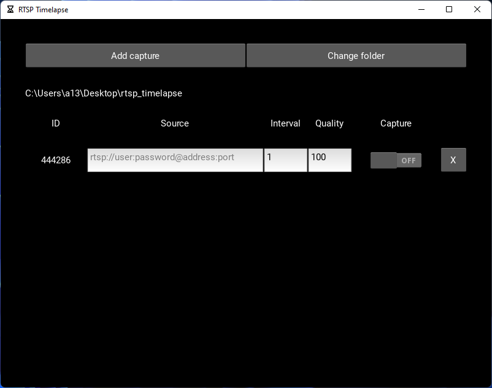

# RTSP Timelapse

App for capturing images via Real-Time Streaming Protocol (RTSP).  
Useful for creating timelapse videos.  
Tested on Windows 10/11

## Dependencies
- Kivy
- OpenCV

## Installation
1. Go to [releases section](https://github.com/zerson13/rtsp-timelapse/releases)
2. Download the `.zip` file.
3. Extract files and run `rtsp_timelapse`

## Overview

- **ID** - capture ID and the name of the folder where the images will be stored

- **Source** - valid RTSP URL

- **Interval** - image capture interval (in seconds)

- **Quality** - JPEG quality (1-100, %)

- **Capture** - switch for capturing

- **X button** - remove capture source (images folder will remain)
